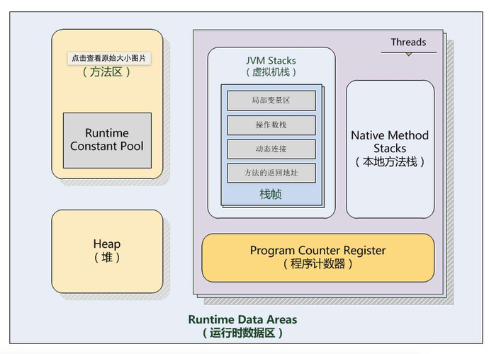
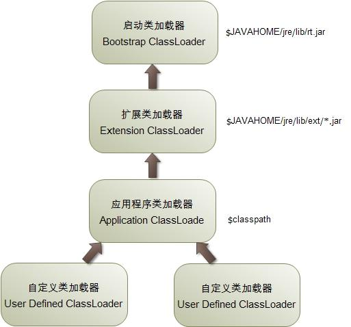
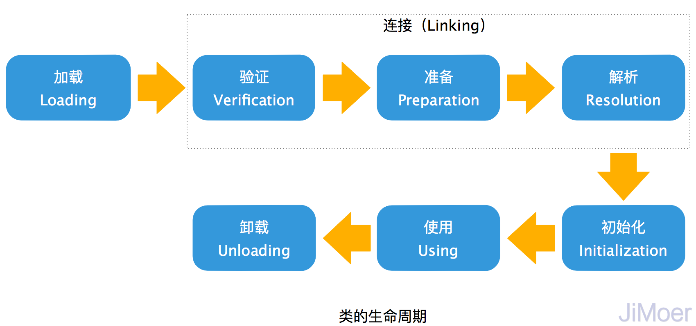

## 说明
类相关课程源码

### 基础
- 类和对象
- new 关键字
- 属性字段
- 方法
- 构造方法
- 封装

| 修饰符             | 同一个类 | 同一个包 | 子类  | 任何地方 |
|-----------------|------|------|-----|------|
| public(公共的)     | Y    | Y    | Y   | Y    |
| protected(受保护的) | Y    | Y    | Y   |      |
| default（默认的）    | Y    | Y    |     |      |  
| private（私有的）    | Y    |      |     |      |

### 继承
- 子类、父类
- extends定义子类
- 修饰符
- 属性的继承
- 方法的继承
- 构造方法
- super和this
- 重写和重载
- 向上转型和向下转型
- final类和方法

### 多态
- 静态分派
- 动态分派
- 单分派和多分派
- 虚拟机动态分派

### 类的加载
- 类的加载和初始化
- 代码块、静态代码块、构造器、属性的初始化顺序

  #### - 虚拟机运行时内存区域划分 -
  
  #### - ClassLoader -
  自下向上委派加载，自上向下尝试加载

  
  #### - 类的生命周期 -
  

### 设计模式
- 抽象类
- 抽象方法
- 策略模式
- 工厂模式

### 接口
- 接口的定义和实现
- 接口的继承
- 接口中的常量
- 接口中的默认方法

### 内部类
- 内部类
- 静态内部类

- 匿名内部类
- 局部内部类
- 回调

- 属性和变量的作用域

### Object类
- equals
- hashCode
- toString

### lambda表达式
- lambda介绍
- 纯方法
- 语法
- 接口
- 方法引用
- 构造器引用
- 变量的作用域