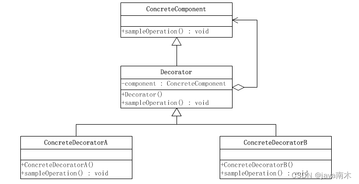

## 说明

### File类
- 绝对路径和相对路径
- File获取文件
- 创建、重命名、移动、删除文件

### 装饰器模式

### InputStream和OutputStream
- FileInputStream
- InputStreamReader
- BufferedReader
- BufferedInputStream
- DataInputStream
- RandomAccessFile

### 对象序列化
- Serializable
- ObjectOutputStream/ObjectInputStream
- Serializable的属性
- 序列化对象版本
