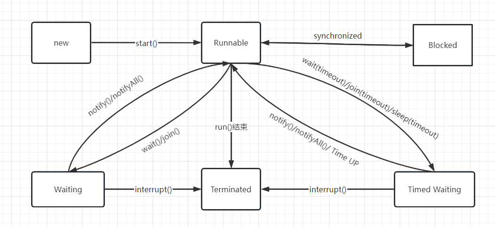

## 说明

### 线程
- 线程和进程
- 线程状态
- 线程创建
- start
- sleep

### 线程的一些其他方法
- 线程名
- 线程优先级 和 yield()
- 守护线程
- 未捕获异常处理
### 中断线程
- 标志位
- interrupt中断线程
- InterruptedException
- 中断状态恢复
```
 Thread.currentThread().interrupt() // 设置当前线程的中断状态
 Thread.interrupted() // 返回当前状态，清除中断状态
 Thread.currentThread().isInterrupted() // 判断当前线程中断状态
```
### 同步代码块
- join
- synchronized
- 监视器锁
- 静态锁/对象锁
- 条件队列
  - wait
  - notify
  - notifyAll
### 线程安全：状态安全 可见性和原子性
- 属性变量和race condition
- final
- 本地变量
- ThreadLocal
- AtomicXXX
- synchronized
- volatile
### 线程安全：顺序安全 有序性
- 指令重排序
- synchronized和监视器锁
- 显示锁
- Lock
- 显示条件队列
  - Condition
### 同步工具类
- CountDownLatch
- CyclicBarrier
- Semaphore
- Phaser
- Exchanger
- Callback
- Future/结束
### 线程安全的集合
- CopyOnWriteArrayList
- ConcurrentHashMap
- SynchronizedXXX
### 阻塞队列
- 阻塞队列
- 生产者消费者模式
- 中断
### 线程池
- Executor
- ThreadPoolExecutor
- Executors
- ExecutorService/ExecutorCompletionService
- 线程池参数介绍
- 默认线程池
- 自定义线程池
- CompletionService
### 性能和活跃性
- 锁竞争
- 死锁
- 饥饿
- 响应性
- 线程开销
